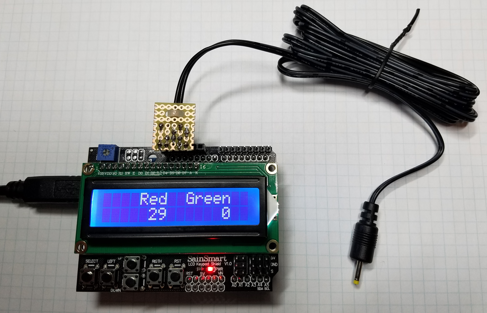
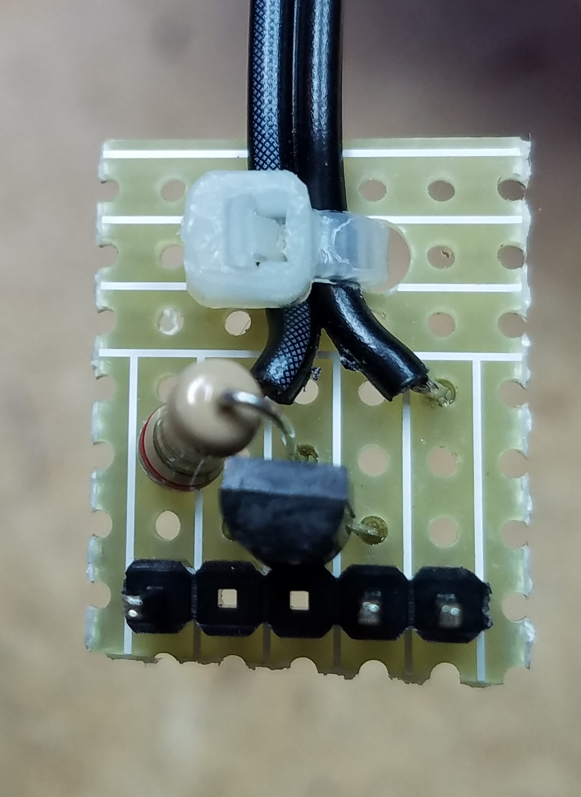
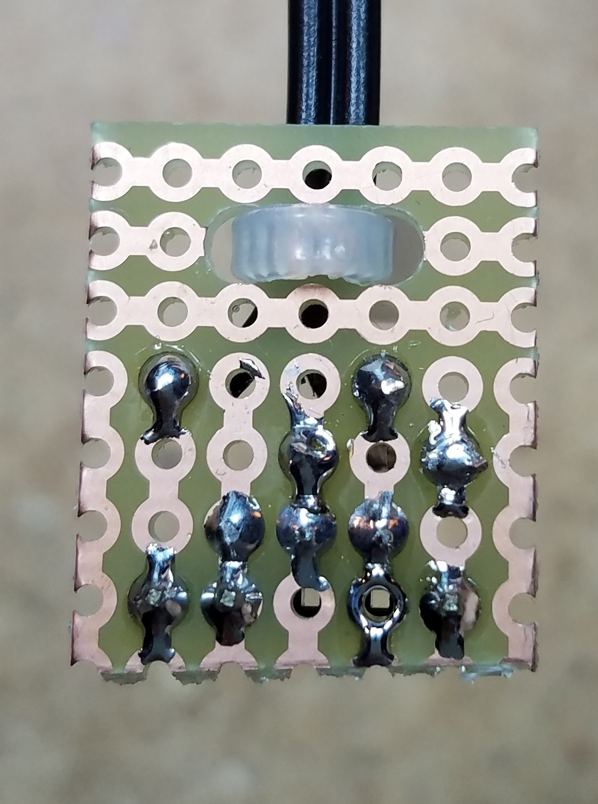

The Calibration Remote Controller connects to an AIRBOAT though the charging jack and lets you precisely adjust the motor control and LED parameters to find the best values. 

#Quick Start

1. You'll need an Airboat board specifically programmed with the calibration controller function enabled in the firmware. You enable it with `#define CALIBRATION` in the source code. 
2. Since the shell and overmold affect the way the motor vibrates and the LEDs look, you should build the board into an assembled unit before tweaking.
3. Connect the Controller USB cable to a computer or power outlet. 
4. Insert the plug from the controller into your special Airboat unit.
5. Push the button on the Airboat to turn it on and select the 1st speed setting. For best results, Airboat should [always be on](#constraints) when changing settings on the controller. 
6. Use the left and right buttons to change the `top` value and the up and down buttons to change the `duty` value. Hold them down to scroll faster. Note that the controller only sends updates when a value changes, so make sure you change both values (click up then down) to update them into the unit. 
7. When you find the exact perfect values, write them down! While the new values are stored in the unit, you will not have any way to see the actual numbers once you disconnect/turn off the controller.
8. You can switch to different speeds on the unit and then use the controller to adjust those speeds. This makes it possible to program a unit with customer speeds for all three settings.
8. Press `select` to go into LED mode.
9. Use the buttons to change the mixture of the red and green LEDs to make nice looking colors, then write down the combinations you like. 
 
#Speed Parameters

Each speed setting has two parameters – the `DUTY` and the `TOP`. 

The `DUTY` controls what percentage of the time the motor is getting power. It ranges from 0 (completely off) to 255 (always on). So, a value of about 128 means that the motor will be getting power about ½ the time. The motor is only rated for 3 volts but the battery is nominally 4.2 volts, so best not to run with `DUTY` set higher than about 186 for too long or the motor might over heat. 

>NOTE: We could someday add a “turbo” mode that severely over powers the motor for short bursts as long as the busts are short enough that the motor doesn’t get too hot. 

`TOP` is the number of counts per on/off cycle where a count is 1/128000th of a second. This selects the frequency at which the motor is turned on and off and ranges from about 2Hz to 64KHz. Note that the steps between available frequencies are larger for lower frequencies.

To normalize the human readable `TOP` value on the controller screen to the computer readable `TOP` and `PRESCALE` values to type into the source code, you can use the included calculator tool here...

http://htmlpreview.github.com//bigjosh/Airboat-PCB/tree/master/calibration-controller/html/calc-top-tool.html

(or open the HTML file directly from you local hard drive)

>NOTE: As you scan though the `TOP` values you will find some that are at frequencies that your ear can hear. We can someday use this to make the motor make beeps and sounds. 

#Usage

To use the Remote Control, plug it into an AIRBOAT with the calibration firmware enabled though the power port. 

You can then use the Remote to update the speed settings.

|Button|MOTOR Mode|LED Mode|
|-|-|-|
|LEFT & RIGHT|TOP|Red|
|UP & DOWN|DUTY|Green

Holding a button down will scroll the value with acceleration for big changes. 

Once you find values that you like for a given speed, write down the two numbers since once you switch to another speed or unplug the Remote, there is no easy way to get them back. 

#Theory of Operation

The controller communicates to the attached AIRBOAT by turning the power supplied though the jack on and off. Each time the power is on, the battery charger chip indicates a "charge in progress", so by turning the power on and off rapidly the controller can send bits to the AIRBOAT.

## Data Format

### Signals

Commands are sent as 16 bit long packets.

A packet always starts with the power off. 

Each packet starts with 10ms of on time. This give the AIRBOAT time to get ready for the first sync pulse. 

Each bit starts with sync pulse that is 3ms of on, followed by a 1ms off. 

The data value is sampled 3ms after the falling edge of the sync pulse.  Timing is based off the falling edge of this sync pulse because the charger reacts quickly to falling voltage but slowly to rising voltage.

To send a 1 bit, the power is left on for 3ms after the sync pulse. 

To send a 0 bit, the power is left on for 3ms after the sync pulse. 

The packet always terminates with the power off. 

Bytes are sent most significant bit first. 

###Constraints

If the power is on for more than about 1.5ms and the battery is fully charged, then the COP will turn off even though power is still applied. This can be avoided but only sending data when the unit is on since the drain of the motor will prevent the charger from detecting EOC.  

Because there is a filtering capacitor across the power jack, it takes about 1ms for the power voltage to drop to 0V after we stop supping power. The COP stops when it hits ~4.5 volts, which happens pretty quickly. 

### Protocol

A command consists of 16 bits.

	// Command format (bits, MSB first)  ccc aaaa bbbbbbbb p
	//
	// c=command code
	// a,b variables
	// p=parity (all bits including parity add up to 0)

	// Commands:
	//
	// 00: NA
	// 01: Set red LED to brightness b
	// 02: Set green LED to brightness b
	// 03: Set motor normalized duty to b
	// 04: Set motor prescaller to a and top to b
	// 05: Reset motor speed steps to factory default values

#Construction

The controller is actually just an Arduino Uno with an [LED Keypad Shield](http://www.dfrobot.com/wiki/index.php?title=Arduino_LCD_KeyPad_Shield_%28SKU:_DFR0009%29). 

The data is output on digital pin D0 because this happens to be in a handly location on the top header of the LCD board- along with Vcc and ground. 

Because the pin can not output enough current to keep  CIP active for long, we use a transistor to switch the full 5V power coming from the Arduino header. It looks like this...

The circuit fits nicely on a little perfboard like this...

The perfboard installs left justified onto [header J8 on the LCD board](0044.lcd-keypad-shield-datasheet.pdf). If constructed as above, the components should be facing down. 

#Future Directions

It would not be hard to integrate the controller functions into the mainline firmware and then make a cute little fob that users could plug into their Airboat to make custom settings. 

This would also open the doors to DYI'ers who wanted to remote control the unit using their own Arduino.  

Might also be nice to add support for patterns rather than just simple on/off PWM.   