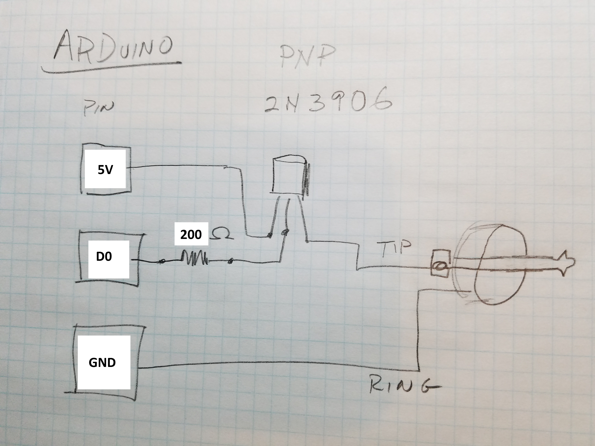

The Calibration Remote Controller connects to an AIRBOAT and lets you precisely adjust the motor control parameters to help find the best values for the AIRBOAT's speed settings. 
 

#Speed Parameters

Each speed setting has two parameters – the DUTY and the FRQ. 

The DUTY controls what percentage of the time the motor is getting power. It ranges from 0 (completely off) to 255 (always on). So, a value of about 128 means that the motor will be getting power about ½ the time. The motor is only rated for 3 volts but the battery is nominally 4.2 volts, so best not to run with DUTY set higher than about 186 for too long or the motor might over heat. 

>NOTE: We could someday add a “turbo” mode that severely over powers the motor for short bursts as long as the busts are short enough that the motor doesn’t get too hot. 

FRQ selects the frequency at which the motor is turned on and off and ranges from about 2Hz to 64KHz. Note that the steps between available frequencies are larger for lower frequencies.

>NOTE: As you scan though the FRQ values you will find some that are at frequencies that your ear can actually hear. We can someday use this to make the motor make beeps and sounds. 

#Usage

To use the Remote Control, plug it into an AIRBOAT with the calibration firmware enabled though the power port. 

You can then use the Remote to update the speed settings.

|Button|Function|
|-|-|
|LEFT & RIGHT|FRQ
|UP & DOWN|DUTY

Holding a button down will scroll the value with acceleration for big changes. 

For reference, the current values are…

|Speed|DUTY|TOP|
|----|----:|----|
|1|3136|7510|
|2|8992|8193|
|3|25400|15660|

Once you find values that you like for a given speed, write down the two numbers since once you switch to another speed or unplug the Remote, there is no easy way to get them back. 

#Theory of Operation

The controller communicates to the attached AIRBOAT by turning the power supplied though the jack on and off. Each time the power is on, the battery charger chip indicates a "charge in progress", so by turning the power on and off rapidly the controller can send bits to the AIRBOAT.

## Data Format

### Signals

Each bit starts with the power off for at least 1ms. To start a bit, we turn the power on from the off state. The receiver synchronizes to this rising edge. 

To send a 1 bit, the power is left on for 1ms.

To send a 0 bit, the power is left on for 500us and then turned off for 500us.

The receiver samples the bit 750us after the initial rising edge. 

Adjacent bits are separated by at least 1ms of off time.

Bytes are sent most significant bit first. 

During idle times, the power can remain on if you want to charge the battery. 

Note that these times are constrained. 

If the power is on for more than about 1.5ms and the battery is fully charged, then the COP will turn off even though power is still applied, so the data sampling should happen well before this. 

Because there is a filtering capacitor across the power jack, it takes about 1ms for the power voltage to drop to 0V after we stop supping power. The COP stops when it hits ~4.5 volts, which happens pretty quickly. 

### Protocol

A speed update consists of 5 bytes of 8 bits each.

The first byte is always 0x55 to indicate a speed set command. 

The second byte is the duty cycle, which can be 0-255. 

The third byte is TOP value, which can be 1-255. This defines the frequency of the cycle in steps. 

The fourth byte is the prescaler and can be 1-6. The clock is divided by the prescaler to generate the steps. A prescaler of "1" corresponds to 128K steps per seconds, "2" is 64K steps per second, etc.   

The 5th byte is an XOR of all the previous bytes. 

#Construction

The controller is actually just an Arduino Uno with an [LED Keypad Shield](http://www.dfrobot.com/wiki/index.php?title=Arduino_LCD_KeyPad_Shield_%28SKU:_DFR0009%29). 

The data is output on digital pin 8. Becuase the pin can not output enough current to keep  CIP active for long, we use a transistor to switch the full 5V power coming from the Arduino header. It looks like this...

(Better to use a 1K resistor for more headroom on charging current). 